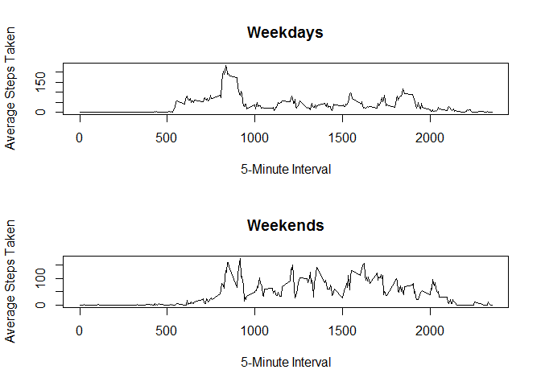

# Reproducible Research: Peer Assessment 1


## Loading and preprocessing the data


```r
activity = read.csv("../repdata-data-activity/activity.csv")
```

## What is mean total number of steps taken per day?

1 .Ignoring the missing vales we attempt to calculate the total number of steps 
taken per day.


```r
tot_steps_per_day <- aggregate(activity$steps, list(activity$date), 
                                   sum, na.rm=TRUE)
```

2. Here is the histogram for the total number of steps taken each day.

```r
hist(tot_steps_per_day[,2], main='Total Number of Steps Taken Per Day', 
     xlab='Total Number of Steps')
```

 

3. The code used for calculating the median and mean of the total number of steps
taken per day.

```r
mean_steps_per_day = mean(tot_steps_per_day[,2])
median_steps_per_day = median(tot_steps_per_day[,2])
```
The calculated mean is 9354.2295082.  
The calculated median is 10395. 

## What is the average daily activity pattern?

1. The time series plot depicting the average of steps for each 5-minute interval.  
The data was aggregated before plotting.

```r
mean_steps_per_day <- aggregate(activity$steps, list(activity$interval),
                                mean, na.rm=TRUE)
plot(mean_steps_per_day[,1], mean_steps_per_day[,2], type="l", 
     main='Average Daily Activity Pattern', xlab='5-Minute Interval',
     ylab='Average Number of Steps Taken')
```

 

2. The code for finding the 5-minute interval with the maximum number of steps.

```r
max_avg_steps <- max(mean_steps_per_day[,2])
max_interval <- mean_steps_per_day[mean_steps_per_day[,2] == max_avg_steps, 1]
```
The 5-minute interval with the maximum number of steps is 835.

## Imputing missing values

1. Code for calculating missing values.

```r
num_miss_val <- length(is.na(activity$steps))
```
Total number of rows missing values is 17568.

2. To fill in the missing values, I used the mean for that 5-minute interval.  

```r
# The first step was to find the indices with NA values
col_with_na <- activity[which(is.na(activity$steps)),]

# I then joined together the data with NA values with the data found earlier 
# (mean_steps_per_day) into a temporary dataframe(temp_df). From there, a new
# dataframe was created(filled_na_df) with the new column; leaving out the column
# with NA values. 
temp_df <- merge(x=col_with_na, y=mean_steps_per_day, 
                  by.x="interval", by.y="Group.1", all.x=TRUE)
filled_na_df <- data.frame(temp_df$x, temp_df$date, temp_df$interval)
colnames(filled_na_df) <- c('steps', 'date', 'interval')

# To be able to combine the new data, I created another df(filled_values_Df) 
# containing only the columns with values from the original dataset.
filled_values_df <- na.omit(activity)

# The two new dataframes are then combined, re-ordered, and re-indexed.
new_activity_df <- rbind(filled_values_df, filled_na_df)
new_activity_df <- new_activity_df[order(new_activity_df$date, 
                                         new_activity_df$interval),]
rownames(new_activity_df) <- 1:nrow(new_activity_df)
```

3. Here is the histogram containing the total number of steps taken each day.

```r
total_steps <- aggregate(new_activity_df$steps, list(new_activity_df$date),
                         sum)
hist(total_steps[,2], main='Total Number of Steps Per Day (Without Missing Values)',
     xlab='Total Number of Steps')  
```

 

4. Code for calculating mean and median.

```r
mean_tot_steps_per_day = mean(total_steps[,2])
median_tot_steps_per_day = median(total_steps[,2])
```
The mean is 10766.1886792.  
The median is 10766.1886792.  
By replacing the NA values, it reduced the lower end total number of steps. What
is more interesting is that the increase of values only affected the center bin
adding about 5 more instances, while the the other bins remained the same.


## Are there differences in activity patterns between weekdays and weekends?

1. The process for creating the new column indicating whether it is a weekday or
a weekend.

```r
# The first thing to change is make the date into a datetime object. Then change
# those dates into the converted day name(Monday, Tuesday, Wednesday, etc.)
activity$date <- strptime(activity$date, "%Y-%m-%d")
activity$day <- weekdays(activity$date)

# To be able to change the names, I created a function that finds the weekend names
# and changes the label depending on whether it is weekday or weekend.
findWeekend <- function(dayOfWeek) {
  weekend <- c('Saturday', 'Sunday')
  if (dayOfWeek %in% weekend){
    return('weekend')
  } else {
    return('weekday')
  }
} 

# This is the applied to the column and all names are changed.
activity$day <- lapply(activity$day, findWeekend)
```

2. Panel plots containing time series plots.

```r
# Break into subsets for weekend and weekdays
weekday_sub <- subset(activity, day == 'weekday')
weekend_sub <- subset(activity, day == 'weekend')

# Aggregate data
mean_steps_weekday <- aggregate(weekday_sub$steps, list(weekday_sub$interval),
                                mean, na.rm=TRUE)
mean_steps_weekend <- aggregate(weekend_sub$steps, list(weekend_sub$interval),
                                mean, na.rm=TRUE)

# Plot panel plots
par(mfrow=c(2,1))
plot(mean_steps_weekday[,1], mean_steps_weekday[,2], type="l", main='Weekdays',
     xlab='5-Minute Interval', ylab='Average Steps Taken')
plot(mean_steps_weekend[,1], mean_steps_weekend[,2], type="l", main='Weekends',
     xlab='5-Minute Interval', ylab='Average Steps Taken')
```

 


